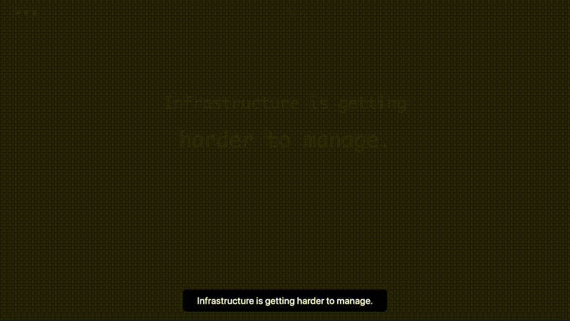

# vssh

[](https://github.com/zeus-kim/vssh/actions/workflows/ci.yml) [](https://pypi.org/project/vssh/) [](LICENSE) [](https://github.com/zeus-kim/vssh/releases/latest)

<div align="center">

# AI asks. vssh answers.

*"Show me my fleet"*  
*"What services are running?"*  
*"Check GPU status"*  
*"Find all services on all servers"*  
*"Suggest reallocation"*  

Just connect Claude and ask.



</div>

---

**The AI Execution Runtime.** Connect Claude, Cursor, or Codex to your infrastructure.

```bash
vssh mcp-install --client claude   # That's it.
```

No sshd. No parsing text. No writing scripts. Just ask.

---

## Install

```bash
# One-line (Linux x86-64/arm64/arm/386/riscv64/ppc64le/s390x, macOS)
curl -fsSL https://raw.githubusercontent.com/zeus-kim/vssh/main/install.sh | bash

# or via pip
pip install vssh
```

---

## Why vssh

`vssh` is not "SSH with a shorter command" — it is a different abstraction for
when the operator is often an **AI agent or automation runtime**, not a person
at a terminal. A quick comparison:

| | OpenSSH | vssh |
|---|---|---|
| Target prerequisite | `sshd` + users + host keys + PAM | one static binary, **no sshd** |
| Auth | passwords / keys via PAM | per-node **Ed25519 VAUTH1**; no shared secret |
| Transport | SSH protocol | **TLS 1.3 + Ed25519 raw-key pinning** |
| Host identity | `known_hosts` TOFU | pinned registry, **default-on**, anti-misroute |
| Command result | raw text stream | **typed evidence** (stdout/stderr/exit/duration/transport) |
| Authorization | shell = full access | per-key **capabilities** + command **policy** |
| Audit | none built in | **hash-chained** record per action |
| Long-running work | tmux / nohup | `job_start/status/logs/cancel` + artifacts |
| Multi-node | scripting | native fan-out + capability/health **routing** |
| AI / automation | parse text | **MCP-native** typed tools |
| Fleet state | none | **signed** fleet snapshot, replicable to nodes |
| Onboarding | manual | zero-touch auto-setup; one-command MCP attach |

`vssh` doesn't wrap OpenSSH: for a one-off shell on a box where vssh isn't
installed, plain `ssh` is the zero-setup option. On a fleet already running
vssh, the CLI covers interactive shells (`vssh shell`), file transfer, and
tunnels too — no `ssh` needed. Full rationale:
[docs/WHY_VSSH.md](docs/WHY_VSSH.md).

**Out of scope:** operating the VPN mesh and the monitoring dashboards — bring
your own (e.g. Tailscale or WireGuard for the network layer, your own
metrics/monitoring stack).

---

## Attach to your AI client (one command)

`vssh` is an MCP server built into the binary. Attach it to an AI client without
hand-editing any JSON:

```bash
vssh mcp-install --client claude     # or: claude-code, cursor, gemini, codex
# preview/print instead of writing:
vssh mcp-config  --client claude
```

This merges a `vssh` MCP server entry (pointing at the absolute binary path) into
the client's config, preserving existing servers. Restart the client and the AI
can route, gate, and run fleet work with an audit trail. On first use, `vssh`
auto-provisions host-identity verification (zero-touch) — no manual setup step.

---

## Install

### One-line installer (recommended)

```bash
curl -fsSL https://raw.githubusercontent.com/zeus-kim/vssh/main/install.sh | bash
```

The installer detects your OS/arch, downloads the matching binary from the
[latest GitHub release](https://github.com/zeus-kim/vssh/releases/latest),
**verifies its SHA-256 against the published `checksums.txt`**, and installs to
`~/bin`. Releases cover Linux `amd64/arm64/arm/386/riscv64/ppc64le/s390x` and
macOS `amd64/arm64` (FreeBSD is an experimental build).

```bash
curl -fsSL .../install.sh | VSSH_VERSION=0.7.42 bash   # pin a version
curl -fsSL .../install.sh | INSTALL_DIR=/usr/local/bin bash
```

### pip (CLI + Python SDK)

```bash
pip install vssh
```

Installs the `vssh` CLI (the Go binary is fetched + checksum-verified for your
platform on first run, cached under `~/.vssh/bin`) **and** the Python SDK
(`from vssh import VSSH`).

### From source

```bash
git clone https://github.com/zeus-kim/vssh && cd vssh
make build          # builds ./vssh   (Go 1.25+)
make install        # installs to /usr/local/bin (sudo)
```

---

## Quick start

On the **target** node, start the daemon (key-only auth — nothing to configure):

```bash
vssh server                  # listens on :48291
```

Authorize a client by adding its public key to the server's
`~/.vssh/authorized_keys` (run `vssh keygen` on the client to print its key). For
a fleet, `scripts/enroll.sh <node>` does this from a controller automatically.
Then, from the client:

```bash
vssh run web1 "df -h"        # run a command, get structured evidence
vssh web1                    # interactive shell (PTY)
vssh put ./app web1:/tmp/    # upload a file
vssh get web1:/var/log/x .   # download a file
vssh fwd web1 -L 8080:localhost:80   # local port-forward (also -R, -D SOCKS)
vssh                         # fleet dashboard
vssh doctor --json           # diagnose binary, auth model, config, peers, MCP
```

`vssh run` returns an evidence envelope — exit code, durations, transport, and
the endpoints it tried — not just raw text.

---

## How it works

```text
vssh client ──TLS 1.3──▶ vssh server ──▶ typed exec / file / job / tunnel / RPC ──▶ structured evidence
            (Ed25519 pinned)   (:48291)
```

1. **Transport** — TLS 1.3 with the daemon's **Ed25519 public key pinned**
   (raw-key, not a CA). TLS-first; `VSSH_REQUIRE_TLS=1` refuses plaintext.
2. **Host identity** — the client verifies it reached the *intended* host by
   checking the daemon key against a trusted registry (default-on since 0.7.33),
   so a name can't be silently misrouted to the wrong machine.
3. **Authentication** — per-node **Ed25519 challenge–response (VAUTH1)** only.
   No shared secret; a client is authorized by listing its public key in
   `~/.vssh/authorized_keys` (or `/etc/vssh/authorized_keys`). The daemon rejects
   any non-VAUTH1 auth line.
4. **Policy + audit** — commands are classified and can be gated before
   execution (per-key allow/deny, path scope, rate, capabilities), and every
   action is written to a hash-chained audit log attributed to the key.
5. **Fleet state** — the controller can build a **signed, timestamped** snapshot
   of the whole fleet and replicate read-only copies to nodes for durability.

---

## CLI reference

```
Execution
  vssh <node>                 Interactive PTY shell
  vssh run <node> <cmd>       Run a command (structured result)
  vssh run-many <n1,n2> <cmd> Run across comma-separated nodes
  vssh run-batch <node> ...   Run multiple commands on one session

Typed APIs
  vssh rpc <node> <method> [json]   Call a typed daemon RPC (incl. node_info)
  vssh rpc-many <nodes> <method>    RPC across nodes
  vssh facts <node>                 Typed host facts
  vssh facts-many <nodes>           Facts across nodes

Jobs (long-running)
  vssh job-start <node> <cmd>  / job-status / job-logs / job-cancel
  vssh artifact-collect <node> Collect output artifacts

Files & tunnels
  vssh put <local> <node:path> Upload
  vssh get <node:path> <local> Download
  vssh fwd <node> -L [bind:]<lport>:<host>:<port>   Local forward
  vssh fwd <node> -R [bind:]<rport>:<host>:<port>   Reverse forward
  vssh fwd <node> -D [bind:]<port>                  Dynamic SOCKS5

Identity & fleet state
  vssh keygen [--rotate]       Show (or rotate) this host's Ed25519 identity
  vssh pubkey                  Print this host's public key
  vssh fleet-state [build [--live]|show|verify]   Signed fleet snapshot (--live probes reachability)

Setup & MCP
  vssh mcp                     Run the MCP server (for AI agents)
  vssh mcp-install --client <c>  Attach vssh to an AI client (claude|claude-code|cursor|gemini|codex)
  vssh mcp-config  [--client c]  Print the MCP config snippet
  vssh setup                   First-run self-configuration

Fleet & ops
  vssh / vssh status           Dashboard
  vssh list                    List known nodes
  vssh doctor [--json]         Diagnose local setup
  vssh deploy <node>           Atomic binary install + restart + verify
  vssh server                  Run the daemon
  vssh version / help
```

---

## MCP server (for AI agents)

`vssh mcp` exposes typed tools that return execution evidence — not raw text to
parse. This is what makes vssh an **AI execution runtime**, not just an SSH
replacement.

### AI-native capabilities

| Category | Tools | What it enables |
|----------|-------|-----------------|
| **Memory** | `vssh_memory` (get/set/note/auto_note/find/ask) | Per-node role, services, tags, notes — the AI remembers your fleet. |
| **Intent** | `vssh_intent` | Natural language → command plan. "Check disk on all web servers" becomes an executable plan with policy verification. |
| **Workflow** | `vssh_workflow` (list/run/status) | Predefined multi-step flows the AI can invoke by name. |
| **Diff** | `vssh_diff` | Human-readable summary of audit-log changes — what changed, when, by whom. |

### Core execution tools

| Group | Tools |
|------|-------|
| Discovery / state | `vssh_fleet` (doctor, status, list, hosts, state, setup) |
| Routing | `vssh_route` (select, policy_check) |
| Execution | `vssh_exec` (plain, safe, routed, many) |
| Typed RPC / facts | `vssh_query` (facts, facts_many, rpc, rpc_many) |
| Jobs / artifacts | `vssh_job` (start, status, logs, cancel), `vssh_transport` (tunnel, artifact_collect) |
| Config (gated) | `vssh_config` (list, authorize_key, revoke_key, set_node, pin_node) |

**Safety model:** destructive commands (`rm -rf`, `shutdown`, `reboot`,
`docker rm`, `kubectl delete`, …) are **blocked** unless `allow_dangerous: true`
after explicit human approval. Config-mutating tools require
`VSSH_ALLOW_CONFIG_WRITE=1`. Every response is a structured evidence envelope.
See [docs/MANUAL.md](docs/MANUAL.md).

---

## Python SDK

```python
from vssh import VSSH

client = VSSH()                            # key-only auth; no secret to configure
client.exec("web1", "uptime")              # -> ExecResult(stdout, exit_code, ...)
client.exec_many(["web1", "db1"], "uptime")
client.facts("web1")                        # typed host facts
job = client.job_start("web1", "long-task")
client.job_status("web1", job["job_id"])
client.doctor()
```

The SDK is a thin client over the installed `vssh` binary (it does not
reimplement the protocol), so it inherits the same transport, auth, and policy.
See [docs/PYTHON_SDK.md](docs/PYTHON_SDK.md).

---

## Configuration

### Node inventory — `~/.vssh/servers.json`

```json
{
  "web1": { "ip": "192.0.2.10", "user": "deploy", "tags": ["linux", "web"], "capabilities": ["docker"] },
  "gpu1": { "ip": "192.0.2.20", "user": "ubuntu", "tags": ["gpu"], "capabilities": ["cuda", "ollama"], "monitor_port": 8721 }
}
```

Nodes are also discovered from a Wire coordinator, Tailscale, and a local cache.
**Do not commit a real `servers.json`, hostnames, VPN IPs, or keys** — keep
inventory outside the repo and use example values in docs.

### Environment variables

| Variable | Purpose |
|----------|---------|
| `VSSH_PORT` | Daemon listen port (default **48291**). |
| `VSSH_REQUIRE_TLS` | `1`/`true`/`yes` = refuse non-TLS (plaintext) connections; matches the state `node_info` reports. |
| `VSSH_REQUIRE_VAUTH` | `1` = require per-node key auth (enforced fleet-wide). |
| `VSSH_NO_HOSTKEY_VERIFY` | `1` = opt out of host-identity verification (not recommended). |
| `VSSH_NO_AUTOSETUP` | `1` = disable zero-touch auto-setup on first MCP exec. |
| `VSSH_ALLOW_CONFIG_WRITE` | `1` = allow the gated AI config-management MCP tools. |
| `VSSH_VERSION` | (installer / pip wrapper) pin the binary release to fetch. |
| `VSSH_HOME` | Override the `~/.vssh` directory. |

---

## Security

- The daemon grants authorized peers command execution and file transfer **as
  the configured user** — treat access as root-equivalent.
- Authentication is **per-node Ed25519 keys (VAUTH1)** only; there is no shared
  secret. Authorize clients via `~/.vssh/authorized_keys`; enforce encryption
  with `VSSH_REQUIRE_TLS=1` and key-auth with `VSSH_REQUIRE_VAUTH=1`.
- The VPN (WireGuard/Tailscale) encrypts the tunnel but is **not** a substitute
  for vssh authentication — authorize keys and firewall the listen port.
- Rotate keys with `vssh keygen --rotate` + `scripts/rotate_authorized_key.sh`;
  see [docs/KEY_ROTATION.md](docs/KEY_ROTATION.md).
- Report vulnerabilities via
  [GitHub Security Advisories](https://github.com/zeus-kim/vssh/security/advisories/new).

Full model and the external-audit package: [SECURITY.md](SECURITY.md) ·
[docs/SECURITY_AUDIT_PACKAGE.md](docs/SECURITY_AUDIT_PACKAGE.md).

---

## Documentation

- [AI Runtime](docs/AI_RUNTIME.md) — Memory, Intent, Workflow, Diff capabilities
- [Why vssh](docs/WHY_VSSH.md) — positioning, ssh vs vssh, what ships today
- [Python SDK](docs/PYTHON_SDK.md) · [Usage manual (CLI + MCP)](docs/MANUAL.md)
- [Key rotation & recovery](docs/KEY_ROTATION.md) · [Security audit package](docs/SECURITY_AUDIT_PACKAGE.md)
- [Examples](examples/) · [SECURITY.md](SECURITY.md) · [CONTRIBUTING.md](CONTRIBUTING.md) · [CHANGELOG.md](CHANGELOG.md) · [한국어 README](README.ko.md)

## Building & contributing

```bash
make build      # build ./vssh
make test       # go test ./... + Python SDK tests
make release    # cross-compile 9 targets (7 linux arches + macOS amd64/arm64) into dist/
```

See [CONTRIBUTING.md](CONTRIBUTING.md).

## License

Apache-2.0 — see [LICENSE](LICENSE).
